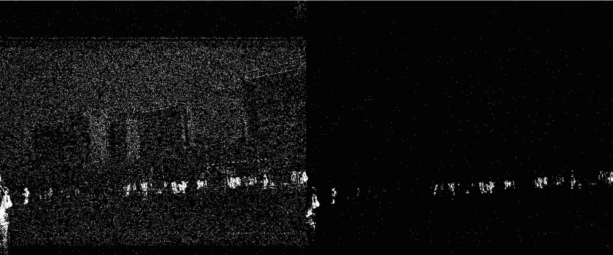
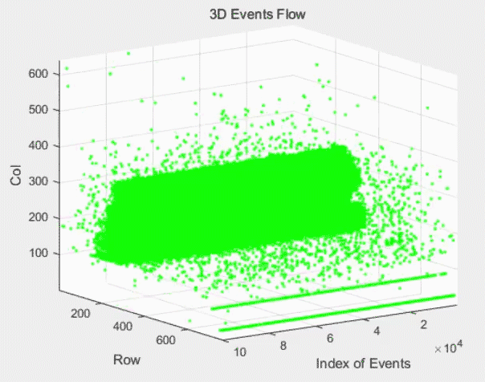

# CelexMatlabToolbox
[README in English](README.md)
## 基本介绍

CelexMatlabToolbox是针对Celex IV的采集数据进行处理的Matlab工具箱。

本工具箱对GUI版本1.4及2.1录制数据均兼容。

## 文件结构及功能说明

- `createImgFromRawData.m`(即上一版发布的文件`bin2picByFixedAmountOfEvents.m`)
  - 针对bin文件实时解码
  - 二值图像的实时显示及存储；
  - 灰度图像的实时显示及存储；
  - 累积式灰度图的实时显示及存储；
- 函数集合`functions`
  - 对bin文件进行批量解码为`x,y,adc,t`格式(其中`t`为连续时间)；
  - 将解码事件转存为mat文件及其读取；
  - 二值图的显示及存储；
  - 灰度图的显示及存储；
  - 累积式灰度图的显示及存储；
  - 去噪二值图的显示及存储；
  - 去噪灰度图的显示及存储；
  - 事件流的三维动态显示。
- `demo.m`
  - 可运行的示例文件，**提供对所有工具箱函数的调用示例**。

## 部分效果展示

- **去噪**

- **3D事件流**

## 使用说明

- 使用前
  - 请右键点击`CelexMatlabToolbox`包含文件夹及其子文件夹；
  - 根据自己的需要修改`demo.m`中相应路径。
- 对于`functions`中每个函数都含有相应的功能及输入输出描述，具体请使用`help`+函数名查看，如`help showAllPic`;
- **所有函数输入输出示例均可以在`demo.m`文件中查看**。
  - 在使用时，选择`%%`号分割开的各代码节，根据需要运行的函数，依次在相应的代码节中，点击工具栏中的**运行节**按钮，实现相应的功能。

## TODO

- [ ] 考虑空间关联特性改进去噪效果
- [ ] 考虑FPN改进去噪效果
- [ ] 对于事件显示加入`overlap`参数
- [ ] 基于时间片段的事件累积

## LICENSE

- `Apache-2.0`
